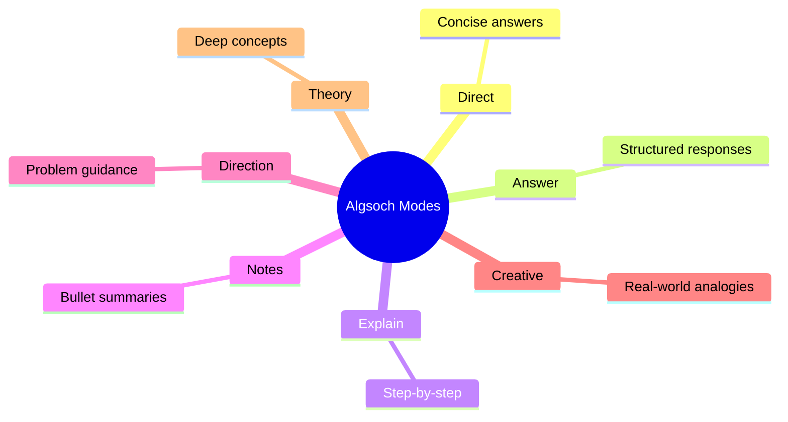
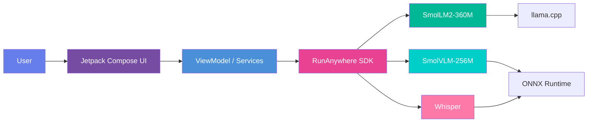
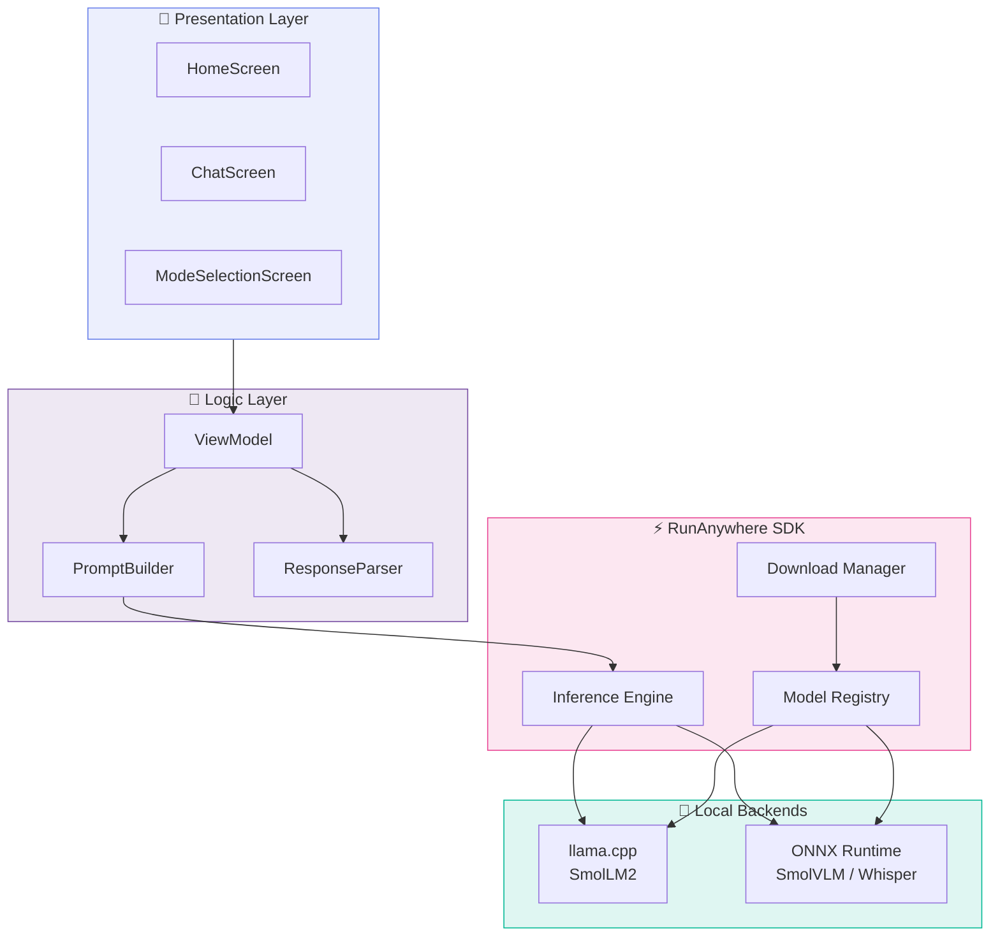
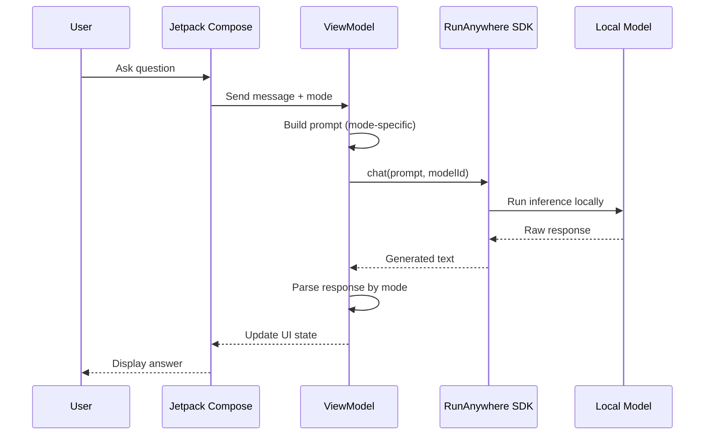
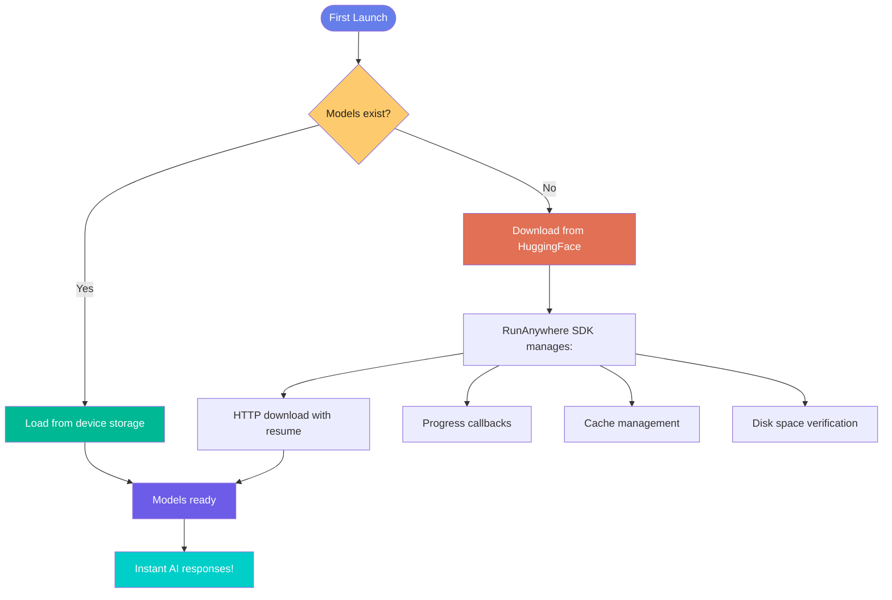

<picture>
  <source media="(prefers-color-scheme: dark)" srcset="https://capsule-render.vercel.app/api?type=waving&color=0:667eea,100:764ba2&height=200&section=header&text=Algsoch&fontSize=80&fontColor=fff&animation=fadeIn&fontAlignY=35">
  
</picture>

<div align="center">
  <h1>🧠 Algsoch — AI Study Companion</h1>
  <p><strong>Learn Smarter, Not Harder — 100% Offline</strong></p>
  <p>Powered by <a href="https://www.runanywhere.ai/"><strong>RunAnywhere SDK</strong></a> — On-Device AI Inference</p>

  <p>
    <a href="https://github.com/FiscalMindset/algsoch/releases"></a>
    
    
    
    
  </p>
</div>

---

## 📑 Quick Navigation

<table align="center">
  <tr>
    <td align="center"><a href="#about">📖 About</a></td>
    <td align="center"><a href="#features">✨ Features</a></td>
    <td align="center"><a href="#modes">🎯 Modes</a></td>
    <td align="center"><a href="#tech-stack">⚙️ Tech Stack</a></td>
    <td align="center"><a href="#quick-start">🚀 Quick Start</a></td>
    <td align="center"><a href="#architecture">🏗️ Architecture</a></td>
    <td align="center"><a href="#faq">❓ FAQ</a></td>
    <td align="center"><a href="#contact">📬 Contact</a></td>
  </tr>
</table>

---

<!-- ==================== ABOUT ==================== -->
<details open id="about">
<summary><strong>📖 About Algsoch</strong></summary>
<br>

Algsoch is an **advanced AI-powered study companion** built with **RunAnywhere SDK** that adapts to your learning style. With **7 different learning modes** and cutting-edge AI models (SmolLM2-360M, SmolVLM-256M) running **100% on your device**, Algsoch provides personalized help for any subject.

**Everything works completely offline.** No internet. No data uploads. No tracking.

<table>
  <tr>
    <td width="25%" align="center">🔓 <br><strong>Works Offline</strong><br><small>No internet required</small></td>
    <td width="25%" align="center">⚡ <br><strong>Lightning Fast</strong><br><small>Sub-second latency</small></td>
    <td width="25%" align="center">🔒 <br><strong>100% Private</strong><br><small>Zero data uploads</small></td>
    <td width="25%" align="center">📦 <br><strong>Lightweight</strong><br><small>~45 MB installed</small></td>
  </tr>
</table>

### Demo
  <a href="https://youtu.be/8L3svJ2HgI0">
    
  </a>

</details>

---

<!-- ==================== FEATURES ==================== -->
<details id="features">
<summary><strong>✨ Features</strong></summary>
<br>

### Current (v1.0.0)

<table>
  <tr>
    <td>✅ 7 Learning Modes</td>
    <td>✅ On-device AI inference</td>
  </tr>
  <tr>
    <td>✅ Text-based learning</td>
    <td>✅ Full chat history</td>
  </tr>
  <tr>
    <td>✅ Local data storage</td>
    <td>✅ Multi-language support</td>
  </tr>
</table>

### What You Can Do

| | |
|---|---|
| 📖 **Study Any Subject** | Mathematics, Science, Languages, Programming, History, Economics, and more |
| 📸 **Upload Images** | Capture diagrams, equations, handwritten notes, charts |
| 💾 **Save Progress** | Full chat history stored locally, private and encrypted |
| 🎓 **Learn Your Way** | Adaptive responses across 7 learning modes |

### Roadmap

| Feature | Status |
|---------|--------|
| Vision/Image analysis | 🔜 Planned |
| Handwriting recognition | 🔜 Planned |
| Voice input/output | 🔜 Planned |
| Study plan generation | 🔜 Planned |
| Progress tracking dashboard | 🔜 Planned |
| Multiple language support | 🔜 Planned |

</details>

---

<!-- ==================== MODES ==================== -->
<details id="modes">
<summary><strong>🎯 7 Learning Modes</strong></summary>
<br>

Algsoch adapts to your unique learning style with 7 powerful modes:

<div align="center">

| Mode | Description |
|------|-------------|
| **Direct** 💬 | Get straight, concise answers instantly |
| **Answer** ✓ | Focused, well-structured responses |
| **Explain** 📖 | Deep dive with step-by-step breakdowns |
| **Notes** 📝 | Formatted bullet-point study notes |
| **Direction** 🧭 | Problem-solving approach guidance |
| **Creative** 💡 | Analogies and real-world examples |
| **Theory** 🔬 | Advanced conceptual deep-dives |

</div>



</details>

---

<!-- ==================== TECH STACK ==================== -->
<details id="tech-stack">
<summary><strong>⚙️ Tech Stack</strong></summary>
<br>



### AI Models

| Component | Model | Size | Engine |
|-----------|-------|------|--------|
| **LLM** | SmolLM2-360M-Instruct | ~300 MB | llama.cpp |
| **Vision** | SmolVLM-256M-Instruct | ~200 MB | ONNX Runtime |
| **Speech** | Whisper | ~150 MB | ONNX Runtime |

### Platform

| | |
|---|---|
| **Framework** | Android / Kotlin |
| **UI Framework** | Jetpack Compose + Material 3 |
| **Data Storage** | Local JSON Database |
| **Processing** | 100% On-Device |
| **Privacy** | Zero Cloud Access |

### Requirements

| Requirement | Minimum | Recommended |
|-------------|---------|-------------|
| **OS** | Android 10 (API 29) | Android 14+ |
| **Storage** | 200 MB free | 1 GB+ |
| **RAM** | 1.5 GB | 3 GB+ |
| **Network** | Not required | Only for model download |

</details>

---

<!-- ==================== QUICK START ==================== -->
<details id="quick-start">
<summary><strong>🚀 Quick Start</strong></summary>
<br>

### Download

<p align="center">
  <a href="https://github.com/FiscalMindset/algsoch/releases">
    
  </a>
</p>

### Installation


#### Step-by-Step

| Step | Action | Details |
|------|--------|---------|
| 1 | **Download APK** | Get the latest release from GitHub |
| 2 | **Allow Unknown Sources** | Settings → Apps → Install unknown apps → Enable |
| 3 | **Install** | Open APK file → Tap "Install" (< 1 min) |
| 4 | **Load AI Models** | ⚠️ Critical — Tap "Load" on first launch (~250 MB) |
| 5 | **Start Learning** | Pick a mode and begin — fully offline! |

> ⚠️ **First Launch:** You must download SmolLM2 model (~250 MB). Takes 2-3 minutes. Retries automatically up to 3 times if download fails.

</details>

---

<!-- ==================== ARCHITECTURE ==================== -->
<details id="architecture">
<summary><strong>🏗️ Architecture</strong></summary>
<br>

### System Architecture



### Data Flow



### Project Structure

```
app/src/main/
├── java/com/algsoch/
│   ├── MainActivity.kt
│   ├── data/
│   │   ├── models/
│   │   │   ├── Message.kt
│   │   │   └── UserPreferences.kt
│   │   └── repository/
│   ├── domain/
│   │   ├── ai/
│   │   │   ├── PromptBuilder.kt    # 7 system prompts
│   │   │   └── ResponseParser.kt
│   │   └── models/
│   │       └── StructuredResponse.kt
│   ├── services/
│   │   ├── ModelService.kt          # ML model management
│   │   └── AIInferenceService.kt
│   └── ui/
│       ├── screens/
│       │   ├── HomeScreen.kt
│       │   ├── ChatScreen.kt
│       │   └── ModeSelectionScreen.kt
│       └── theme/
│           └── AlgsochTheme.kt
└── resources/
    └── drawable/
```

### Model Download Flow



### Key Technologies

| Technology | Purpose |
|------------|---------|
| **Jetpack Compose** | Modern declarative UI |
| **Material 3** | Latest Material Design |
| **Navigation Compose** | Screen navigation |
| **Coroutines & Flow** | Async operations |
| **ViewModel** | State management |
| **RunAnywhere SDK** | On-device AI inference |

</details>

---

<!-- ==================== SDK INTEGRATION ==================== -->
<details id="sdk-integration">
<summary><strong>🔌 RunAnywhere SDK Integration</strong></summary>
<br>

Algsoch is built entirely on **RunAnywhere SDK** — a framework for deploying AI models on mobile devices with zero cloud dependency.

### Gradle Dependencies

```gradle
dependencies {
    implementation("ai.runanywhere:runanywhere-kotlin:0.16.0-test.39")
    implementation("ai.runanywhere:runanywhere-llamacpp:0.16.0-test.39")
    implementation("ai.runanywhere:runanywhere-onnx:0.16.0-test.39")
}
```

### 1. Initialize SDK

```kotlin
class MainActivity : ComponentActivity() {
    override fun onCreate(savedInstanceState: Bundle?) {
        super.onCreate(savedInstanceState)
        RunAnywhere.initialize(
            context = this,
            environment = SDKEnvironment.DEVELOPMENT
        )
        ModelService.registerDefaultModels()
    }
}
```

### 2. Register AI Models

```kotlin
object ModelService {
    fun registerDefaultModels() {
        RunAnywhere.registerModel(
            id = "smollm2-360m-instruct",
            name = "SmolLM2 360M Instruct",
            url = "https://huggingface.co/HuggingFaceTB/...",
            framework = InferenceFramework.LLAMA_CPP,
            memoryRequirement = 300_000_000
        )

        RunAnywhere.registerModel(
            id = "smolvlm-256m-instruct",
            name = "SmolVLM 256M Instruct",
            url = "https://huggingface.co/HuggingFaceTB/...",
            framework = InferenceFramework.ONNX,
            memoryRequirement = 200_000_000
        )
    }
}
```

### 3. Inference in Chat

```kotlin
class AlgsochViewModel : ViewModel() {
    private val runAnywhere = RunAnywhere.getInstance()

    fun sendMessage(userMessage: String, mode: LearningMode) {
        viewModelScope.launch {
            val systemPrompt = PromptBuilder.build(mode)
            val fullPrompt = "$systemPrompt\n\nUser: $userMessage"

            val response = runAnywhere.chat(
                prompt = fullPrompt,
                modelId = "smollm2-360m-instruct",
                temperature = 0.7f,
                maxTokens = 512
            )

            val parsedResponse = ResponseParser.parse(response, mode)
            _uiState.value = ChatUIState.ResponseReceived(parsedResponse)
        }
    }
}
```

### 4. Image Analysis with Vision Model

```kotlin
suspend fun analyzeImage(imagePath: String, query: String): String {
    val runAnywhere = RunAnywhere.getInstance()
    return runAnywhere.vision(
        modelId = "smolvlm-256m-instruct",
        imagePath = imagePath,
        prompt = query,
        temperature = 0.7f
    )
}
```

### 5. Model Downloads

```kotlin
class ModelDownloadManager(private val context: Context) {
    fun downloadModels(): Flow<DownloadProgress> = flow {
        emit(DownloadProgress("Downloading SmolLM2...", 0))
        RunAnywhere.downloadModel("smollm2-360m-instruct")
        emit(DownloadProgress("SmolLM2 downloaded", 50))

        emit(DownloadProgress("Downloading SmolVLM...", 50))
        RunAnywhere.downloadModel("smolvlm-256m-instruct")
        emit(DownloadProgress("All models ready!", 100))
    }
}
```

### SDK Benefits

| Benefit | Description |
|---------|-------------|
| ✓ **Zero Server Dependency** | All AI processing runs locally |
| ✓ **Sub-Second Latency** | Instant responses, no network |
| ✓ **Complete Privacy** | Your data never leaves the device |
| ✓ **Model Management** | Auto download, caching, optimization |
| ✓ **Works Offline** | Perfect for any connectivity |
| ✓ **Optimized Performance** | Quantized models for mobile |

**Learn more:** [RunAnywhere SDK](https://www.runanywhere.ai/)

</details>

---

<!-- ==================== FAQ ==================== -->
<details id="faq">
<summary><strong>❓ FAQ</strong></summary>
<br>

<details>
<summary><strong>Do I need internet?</strong></summary>
<p><strong>No!</strong> Algsoch runs completely offline. All AI processing happens directly on your device.</p>
</details>

<details>
<summary><strong>Are my conversations tracked?</strong></summary>
<p><strong>Never.</strong> All conversations stay locally on your device. We don't collect, store, or upload any data.</p>
</details>

<details>
<summary><strong>Which subjects can I study?</strong></summary>
<p><strong>Any subject!</strong> Math, Science, Languages, Programming, History, Economics, and more.</p>
</details>

<details>
<summary><strong>Is it really free?</strong></summary>
<p><strong>Yes, 100% free.</strong> Open-source with no subscriptions, no ads, no hidden costs.</p>
</details>

<details>
<summary><strong>How do I switch learning modes?</strong></summary>
<p>Tap the <strong>Mode</strong> button in the chat interface to see all 7 learning styles.</p>
</details>

<details>
<summary><strong>Can I upload images?</strong></summary>
<p><strong>Yes!</strong> Use the image button in chat to upload photos of diagrams, equations, notes, or charts.</p>
</details>

<details>
<summary><strong>How much storage do I need?</strong></summary>
<p>App: ~45 MB | Models: ~500 MB (SmolLM2 + SmolVLM) | <strong>Total recommended: 200 MB+ free</strong></p>
</details>

</details>

---

<!-- ==================== CONTRIBUTING ==================== -->
<details id="contributing">
<summary><strong>🤝 Contributing</strong></summary>
<br>

We welcome contributions! See our [Contributing Guide](CONTRIBUTING.md) for details.

```bash
git checkout -b feature/your-feature
git commit -m "Add your feature"
git push origin feature/your-feature
# Then create a Pull Request
```

</details>

---

<!-- ==================== LICENSE ==================== -->
<details id="license">
<summary><strong>📄 License</strong></summary>
<br>

Algsoch is **completely free and open-source**. See [LICENSE](LICENSE) for details.

</details>

---

<footer id="contact" align="center">
  <hr>

  <section>
    <h2>👨‍💻 Creator &amp; Contact</h2>

    

    <h3>Vicky Kumar</h3>
    <p><strong>Creator of Algsoch</strong> — AI Engineer</p>

    <table role="presentation">
      <tr>
        <td align="center">
          <a href="mailto:npdimagine@gmail.com"><strong>📧 Email</strong></a>
          <br><small>npdimagine@gmail.com</small>
        </td>
        <td align="center">
          <a href="https://www.github.com/algsoch"><strong>💻 GitHub</strong></a>
          <br><small>@algsoch</small>
        </td>
        <td align="center">
          <a href="https://www.linkedin.com/in/algsoch"><strong>🔗 LinkedIn</strong></a>
          <br><small>@algsoch</small>
        </td>
      </tr>
    </table>
  </section>

  <hr>

  <blockquote>
    <p><em>Created with dedication to making education more accessible and intelligent through privacy-first AI.</em></p>
  </blockquote>

  <hr>

  <aside style="background:#f0f9ff;border-left:4px solid #667eea;padding:20px;border-radius:6px;text-align:left;">
    <h4 style="margin-block:0 8px;">⚡ Powered By RunAnywhere SDK</h4>
    <p>On-device AI inference framework powering Algsoch's intelligence.</p>
    <div style="display:flex;gap:16px;flex-wrap:wrap;margin-top:12px;">
      <a href="https://www.runanywhere.ai/" style="display:inline-block;background:#667eea;color:#fff;padding:8px 20px;border-radius:6px;text-decoration:none;font-weight:600;">🌐 Website</a>
      <span style="display:inline-block;background:#e0e7ff;color:#667eea;padding:8px 20px;border-radius:6px;font-weight:600;">SDK: 0.16.0-test.39</span>
      <span style="display:inline-block;background:#e0e7ff;color:#667eea;padding:8px 20px;border-radius:6px;font-weight:600;">License: Open Source</span>
    </div>
  </aside>
</footer>
